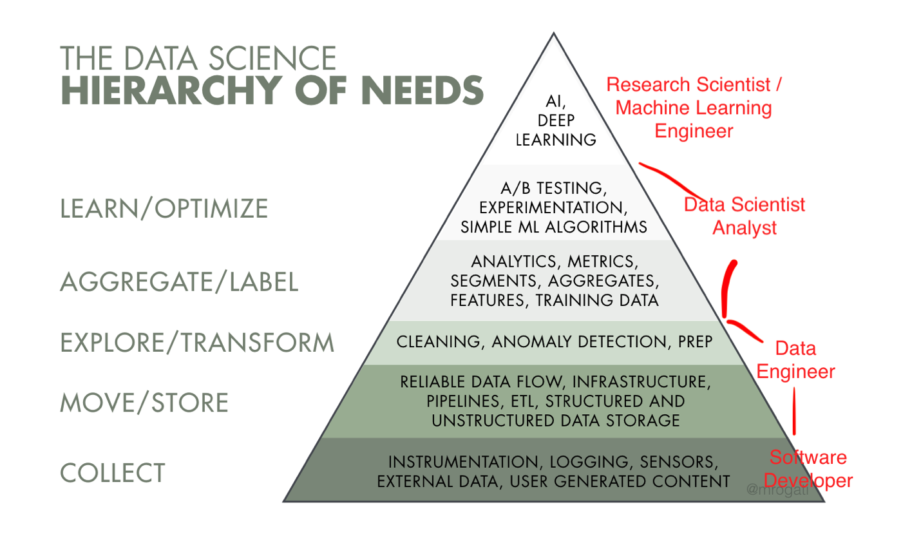

# Data Engineering Nanodegree Udacity
This repo contains my projects while learning the [Data Engineering Nanodegree](https://www.udacity.com/course/data-engineer-nanodegree--nd027) from Udacity.  
In this program, I learned to design data models, build data warehouses and data lakes, automate data pipelines, and work with big datasets. The projects are rather small and simple, but they gave me a good introduction to the big picture of the Data Science - AI industry (figure 1).  
My goal for learning this Nanodegree is to become more aware of the problems relating to data processing that a Machine Learning team faces and the tools needed to solve those problems.  

     
    <em>Figure 1: Data Science Hierarchy of Needs</em>

