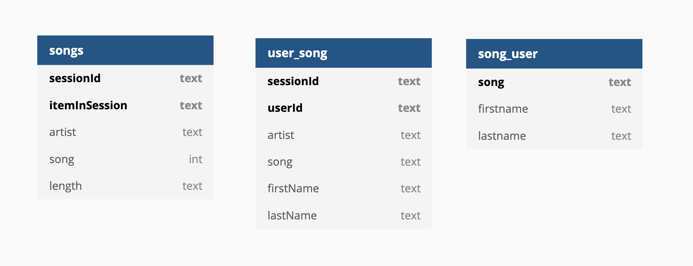

# Project: Data Modeling with Apache Cassandra

## Summary
* [Data Schema](#Data-Schema)
* [Queries](#Queries)
* [Files](#Files)

In this project, we built a database using Apache Cassandra from a song dataset which resides in event_datafile_new.csv (the first few rows of the dataset is in the figure below).  


## Data Schema


## Queries
The three tables above were created in order to answer 3 queries:  
```
Give me the artist, song title and song's length in the music app history that was heard during sessionId = 338, and itemInSession = 4;  
```
```
Give me only the following: name of artist, song (sorted by itemInSession) and user (first and last name) for userid = 10, sessionid = 182;  
```
```
Give me every user name (first and last) in my music app history who listened to the song 'All Hands Against His Own';
```
## Files
`Project_Template.ipynb` - to demonstrate the database building and ETL process.  
`etl.py` - python file that is used to build the database and execute the queries.

