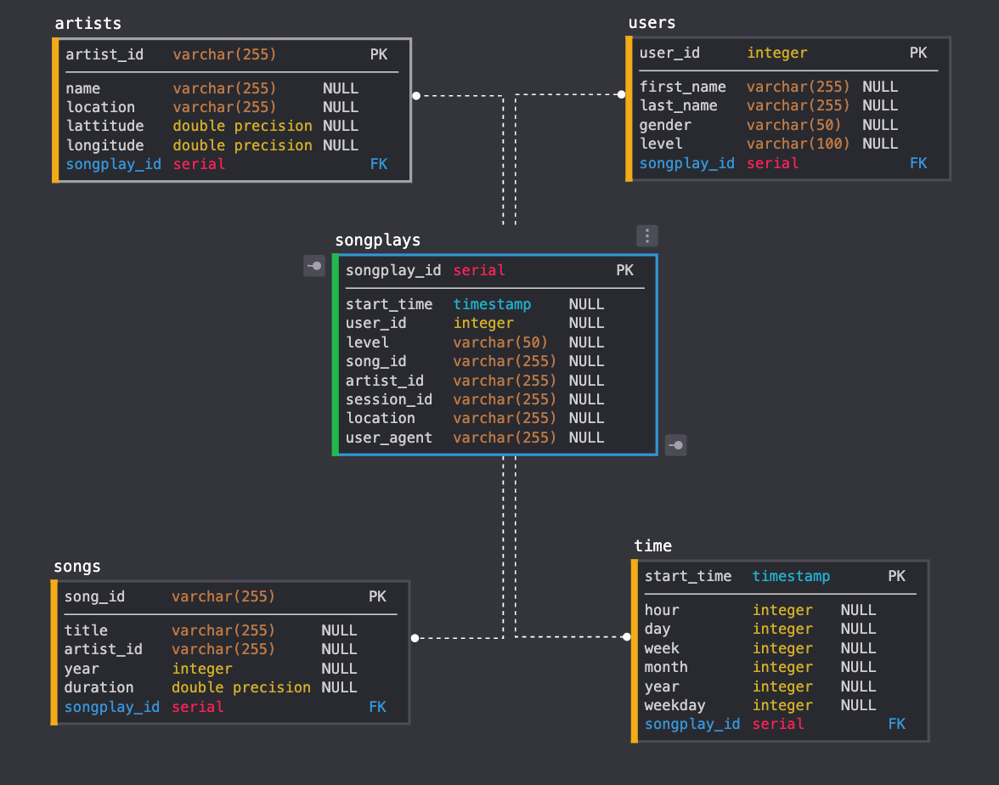

# Data Modeling with Postgres

## Summary
* [Data Schema](#Data-Schema)
* [Project Structure](#Project-structure)
* [Running the files](#Running-the-files)
* [Example queries](#Example-queries)

In this project, we build a database to analyze the collection of song data. The data is recorded in JSON files inside the `data` folder. `log_data`: logs on user activity. `song_data`: metadata of songs.  
The database is built in star schema to optimize the query process the data of songs played.

## Data Schema


## Project Structure
`create_tables.py` - create the tables in the database.    
`etl.py` - implementation of the etl process.  
`sql_queries.py` - contains the queries that are used in etl.ipynb and etl.py.  
`notebooks/test.ipynb` - use to test if the data has been added into the tables.  
 `notebooks/etl.ipynb` - demonstrate the etl process for the tables in the database.  
## Running the files
> 1. run create_tables.py to create the database and tables
> 2. run etl.py to load data into the database
> 3. run test.ipynb to test if it works

## Example Querries
```SQL
SELECT user_id, user_agent, count(user_agent) FROM songplays GROUP BY user_agent;
```
