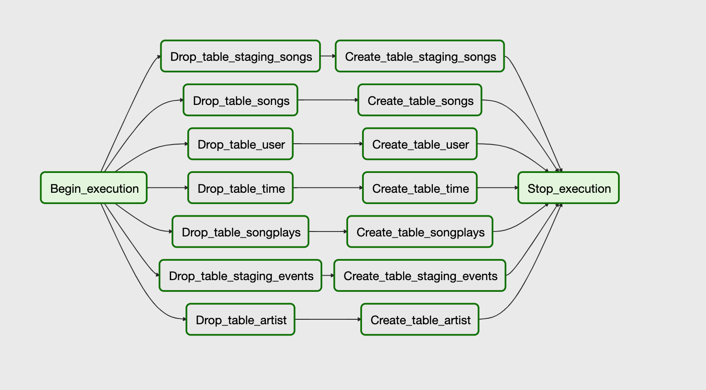
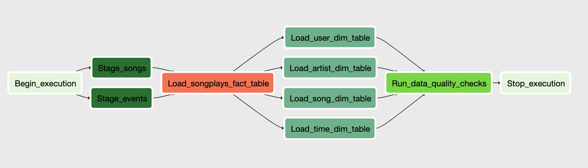
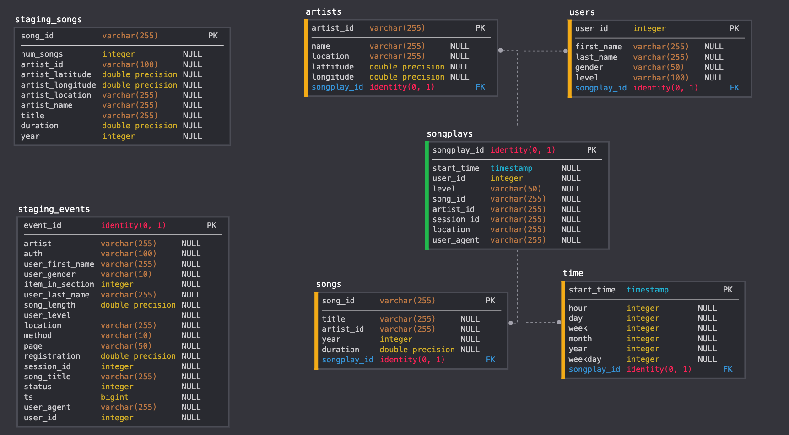
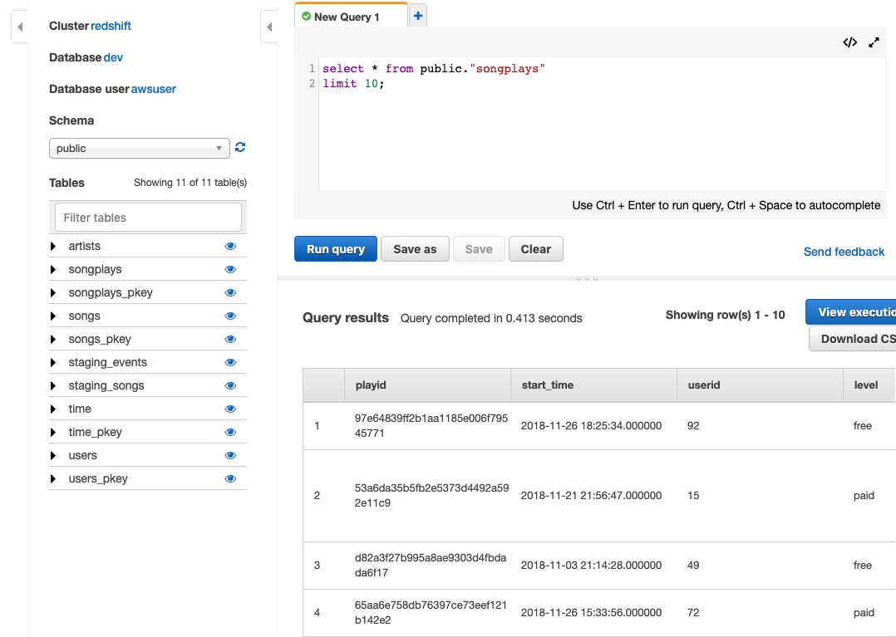

# Project: Data Pipeline with Apache Airflow 
## Summary
* [Data Schema](#Data-Schema)
* [Project structure](#Project-structure) 
* [How to run](#How-to-run)

In this project, we use [Apache Airflow](https://airflow.apache.org/) to automate the ETL data pipeline of building a data warehouse for a mocked music streaming app.  
The music streaming data (json files) is stored in 2 [Amazon S3 buckets](https://s3.console.aws.amazon.com/s3/buckets/udacity-dend/?region=eu-north-1). The pipeline helps schedule and monitor the workflow of creating fact and dimension tables in [Amazon Redshift](https://aws.amazon.com/en/redshift/), copying data from S3 to the temporary staging tables and loading the data to fact and dimension tables. The workflow can be seen in the figures below:

create_drop_tables_dag                    |  etl_dag
:-------------------------:               |:-------------------------:
  |  

## Data Schema

## Project Structure
`airflow/dags` - contains the dags and task dependencies.  
`airflow/plugins/helpers` - contains the SQL queries that we need to create and insert the data into tables.  
`airflow/plugins/operators` - contains the user-defined operators needed.

## How to run
First, you need to create an [Amazon RedShift Cluster](https://docs.aws.amazon.com/redshift/latest/mgmt/working-with-clusters.html) and an [IAM Role](https://docs.aws.amazon.com/IAM/latest/UserGuide/id_roles.html).  
Use Airflow's UI to configure your AWS credentials and connection to Redshift.  
After that, run the dags on Airflow, if the process is successful, you can see the loaded tables from RedShift's queries editor.

