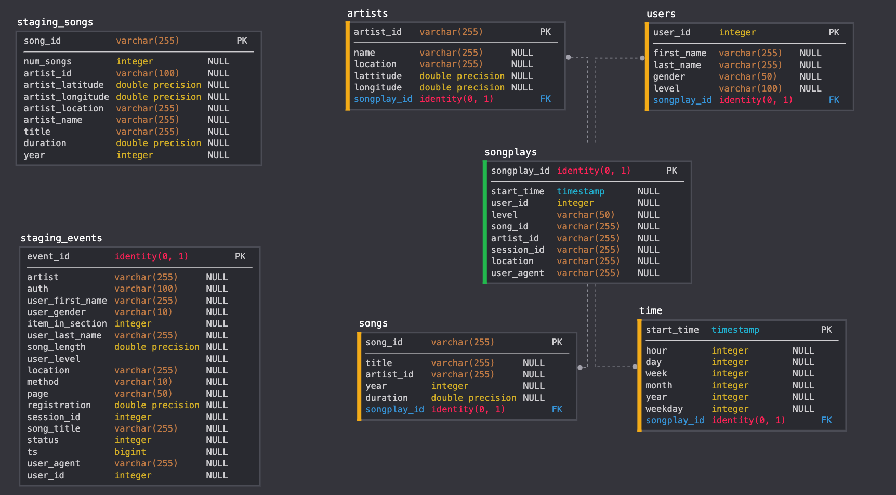
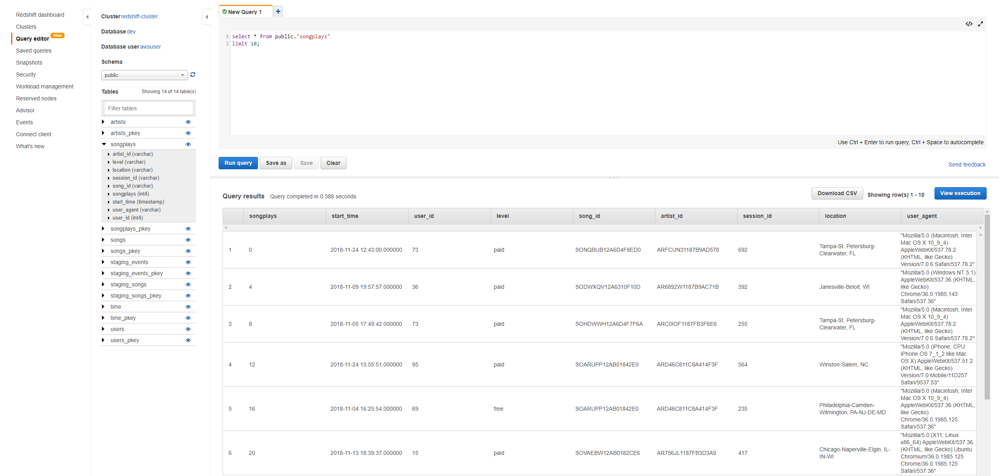

# Project: Data Warehouse with AWS 
## Summary
* [Data Schema](#Data-Schema)
* [ETL Process](#ETL-Process)
* [Project structure](#Project-structure) 
* [How to run](#How-to-run)

In this project, we build a data warehouse for a mocked music streaming app using [Amazon S3](https://aws.amazon.com/en/s3/) and [Amazon Redshift](https://aws.amazon.com/en/redshift/).  
The data resides in two S3 public buckets. The first bucket contains a subset of real song data from the [Million Song Dataset](https://labrosa.ee.columbia.edu/millionsong/) (song title, artist, duration...). The second bucket contains log data about actions done by users (user id, name, registration status...).  
Our task is to build an ETL pipeline that extracts data from S3, stages them in Redshift, then transforms the data into a set of fact and dimension tables so that we can do further analysis with ease and comfort.

## Data Schema

## ETL Process
First, we `COPY` the data from JSON files from the S3 buckets into the staging tables (staging_songs and staging_events). After that, we `INSERT` the data into the fact and dimension tables. 

## Project Structure
`sql_queries.py` - contains the queries for creating, dropping, inserting and copying tables.  
`create_tables.py` - runs the dropping and creating queries.  
`etl.py` - runs the copying and inserting queries.  
`dwh.cfg` - the config file that contains necessary information to run the files (RedShift cluster, IAM Role, links to the public S3 buckets).

## How to run
Prerequisite: You need to have an [Amazon RedShift Cluster](https://docs.aws.amazon.com/redshift/latest/mgmt/working-with-clusters.html) and an [IAM Role](https://docs.aws.amazon.com/IAM/latest/UserGuide/id_roles.html) to successfully run the files.  
After filling in the information in `dwh.cfg`, then run: `python create_tables.py` to create the tables and `python etl.py` to populate the tables.  
The result of the database on AWS will look somewhat like this:

